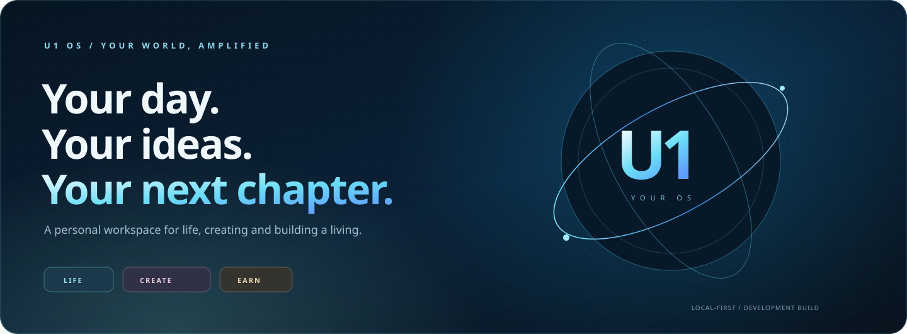
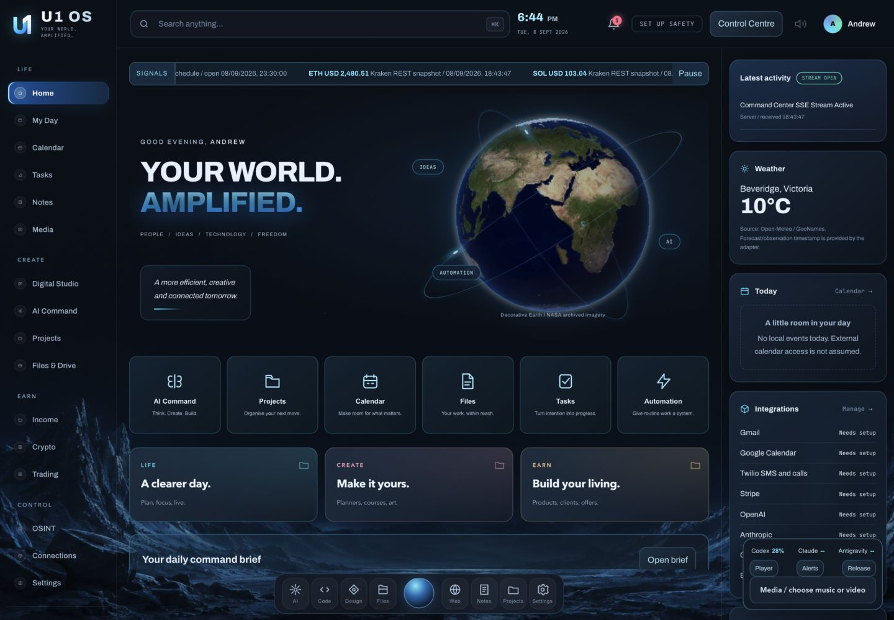
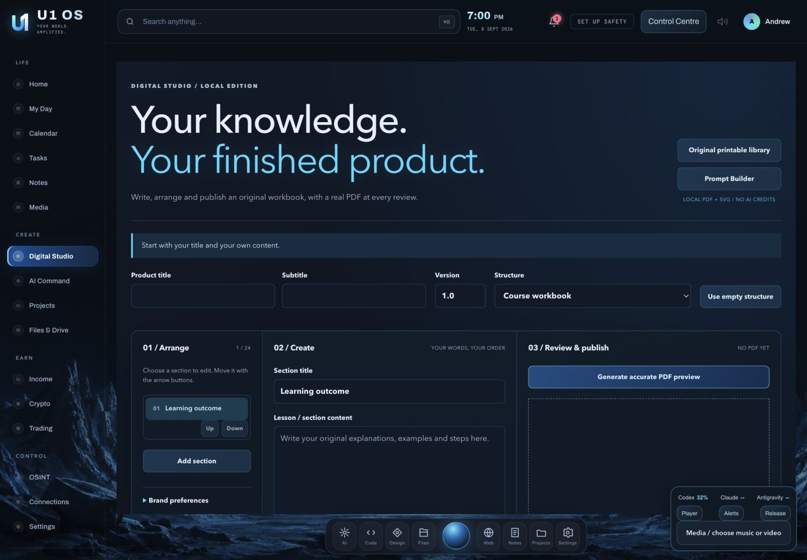
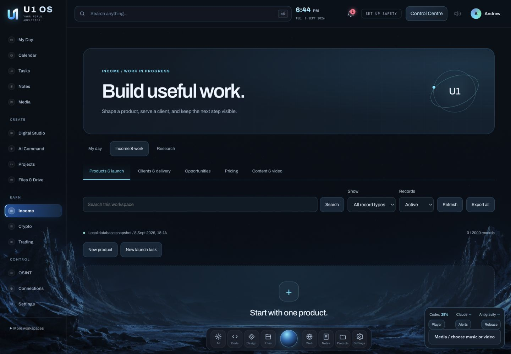
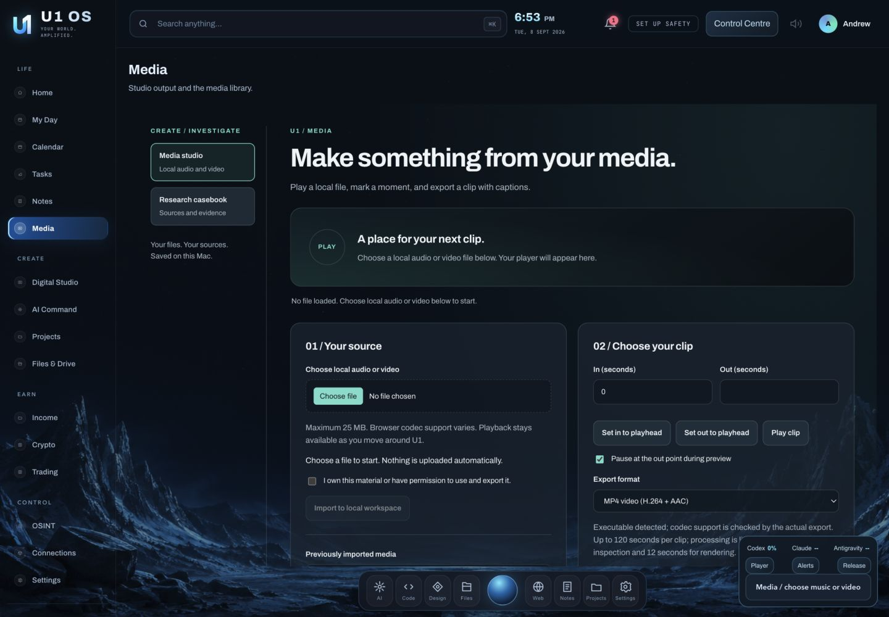

# A little more organised. A lot more possible.

**Your personal workspace for life, creative work and building a living.**

[Explore the workspaces](#one-place-for-the-things-that-matter) · [Start on your Mac](#start-on-your-mac) · [See build status](docs/BUILD-STATUS.md) · [Safety & privacy](#your-work-your-control)

**LOCAL-FIRST** · **MAC WORKSPACE** · **DEVELOPMENT BUILD**

---

## One place for the things that matter

U1 OS brings your day, projects, creative tools and business workflows into one
cohesive interface. Start with what needs your attention, make something useful,
and keep the next step in view.

The new shell is the user-facing entry point. Older shell links redirect into
it; local records and underlying services are preserved rather than discarded.

| **Live your day** | **Make something yours** | **Build your living** |
| :--- | :--- | :--- |
| Tasks, appointments and a daily brief | Planners, course workbooks and original covers | Products, offers and client work |
| Personal priorities and household records | Editable content, real PDFs and product bundles | Launch planning and actual-entry bookkeeping |
| Wellbeing notes and your own media | Source-aware asset organisation | Clearly separate estimates, records and market research |

## A look inside

These are application screenshots, not AI-generated interface mockups. They show
local development views; a displayed setup requirement does not imply an account
is connected. The build evidence records what was actually checked.

### Home: a clearer starting point

### Digital Studio: from an idea to a tangible product

### Income: work with a clear next step

### Media and research, without leaving your OS

## Designed around useful workflows

**My Day.** Bring local appointments, tasks and projects together. Make space for
personal life alongside work instead of maintaining another disconnected dashboard.

**Digital Studio.** Create printable planners, workbooks and course structures
from your own content. Work with actual exported files and an organised product
workflow, not simulated render completions.

**Income.** Shape an offer, track work and plan a launch. Keep operator-entered
financial records separate from estimates and research. No invented revenue or
promise of earnings.

**AI Command.** Review the context and provider before sending a request. Account
access, subscription allowances and optional API billing remain provider-specific.
Nothing is presented as a combined unlimited AI subscription.

**Media & OSINT.** Play your own media and work with authorised material. Research
records retain source links and verification notes. Private account discovery,
access-control bypasses and unauthorised republishing are not supported features.

**Connections.** See the difference between installed software, saved settings,
authorised account access and successful synchronisation. Account setup and
consent are not silently assumed.

## Start on your Mac

This is a local development application. It is not a notarised, independently
self-contained consumer installer.

1. Use the source branch identified in [Build status](docs/BUILD-STATUS.md).
2. Follow the [Mac setup and release guide](docs/MAC-RELEASE.md) for the supported launcher and runtime steps.
3. Start the local service and open `http://127.0.0.1:8788/`.
4. Set up only the integrations you need, then review their permissions and connection status.
5. Configure Safety Centre yourself before relying on the application access lock.

The personal-workspace dependencies are listed in `requirements-personal.txt`.
Desktop signing, notarisation and external-provider setup are tracked separately
from the local source build.

## Your work. Your control.

- **Local-first is not encrypted-by-default.** Local databases, browser drafts and ordinary exports can contain private information.
- **The safety lock protects U1 OS access.** It is not FileVault, a system firewall, a hardware dead-man device or a guarantee that exchange orders stop.
- **Lock, pause and cancellation are distinct.** Managed-job controls apply only to the jobs that implement them.
- **Backups have explicit coverage.** Encrypted copies and separate-folder restore drills do not encrypt the live database or delete existing plaintext backups.
- **Publishing requires intent.** Creating a draft or a product does not post it publicly, make a purchase or execute a trade.
- **Secrets stay out of source uploads.** Runtime data, credentials, personal exports and session material are not GitHub release content.

[Safety setup](docs/SAFETY-LOCK.md) · [Private backups](docs/PRIVATE-BACKUPS.md) · [Connections](docs/CONNECTIONS.md)

## Honest progress, visible evidence

The [60-item build tracker](docs/BUILD-STATUS.md) distinguishes implemented local
workflows, account-dependent adapters, partial capabilities and release work.
A green test result is not proof of a live provider connection or a completed
production security audit.

[Validation evidence](docs/PERSONAL-RELEASE-VALIDATION.md) · [Architecture](docs/U1-OS-ARCHITECTURE.md) · [Design system](docs/U1-OS-DESIGN-SYSTEM.md) · [Earlier technical README](docs/README-ARCHIVE-20260908.md)

---

**U1 OS**

*Build today. Make room for a brighter tomorrow.*

