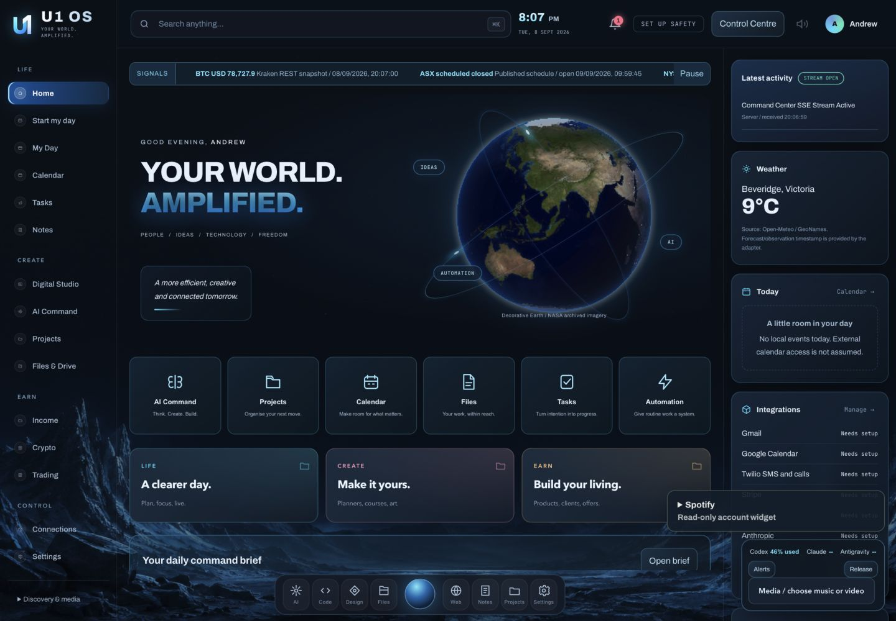
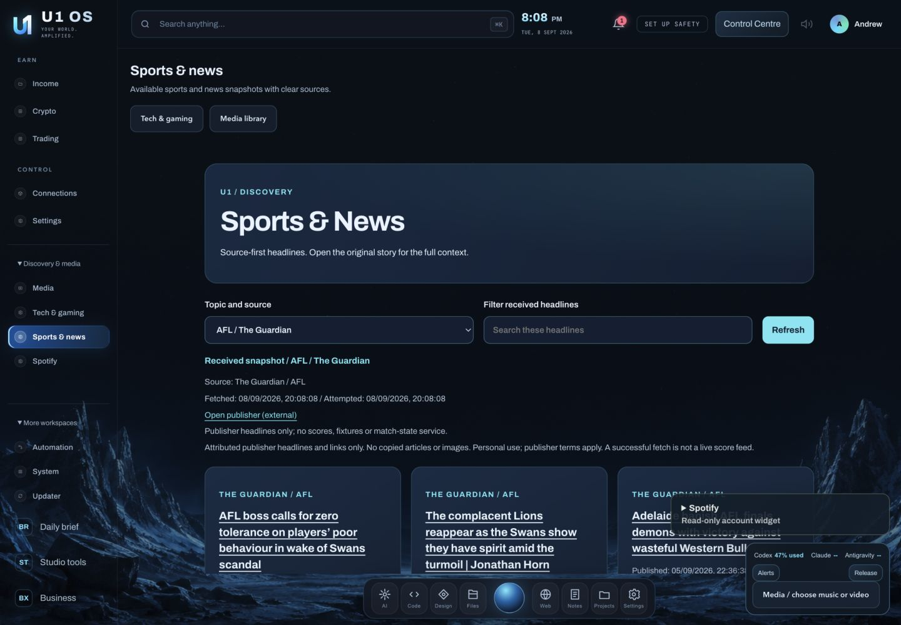

# A little more organised. A lot more possible.

**Your personal workspace for life, creative work and building a living.**

[Explore the workspaces](#one-place-for-the-things-that-matter) · [Start on your Mac](#start-on-your-mac) · [Operational status](docs/OPERATIONAL-UPGRADE.md) · [Review the replacement](docs/REPLACEMENT-REVIEW.md)

**LOCAL-FIRST** · **MAC WORKSPACE** · **PROPOSED REPLACEMENT BUILD**

---

## One place for the things that matter

U1 OS brings your day, projects, creative tools and business workflows into one
cohesive interface. Start with what needs your attention, make something useful,
and keep the next step in view.

The native shell is the user-facing entry point. This build is proposed through
a **replacement pull request**, not a reconciliation of every feature on `main`.
Opening the PR does not change `main`; replacement requires explicit review and
merge approval. Migration of all existing `main` functionality has **not** been
proven. Read the [replacement review guide](docs/REPLACEMENT-REVIEW.md) before accepting it.

| **Live your day** | **Make something yours** | **Build your living** |
| :--- | :--- | :--- |
| Tasks, appointments and a daily brief | Planners, course workbooks and original covers | Products, offers and client work |
| Personal priorities and household records | Editable content, real PDFs and product bundles | Launch planning and actual-entry bookkeeping |
| Wellbeing notes and your own media | Source-aware asset organisation | Clearly separate estimates, records and market research |

## A look inside

### Home: your day in view

### Discovery: headlines with clear sources

These actual **1440 x 1000** browser captures were recaptured and accepted on
**2026-09-08** after the layout and mobile-label fixes. They do not establish live
OAuth/account access, media or file playback, or native Mac-app visual acceptance.

Earlier development screenshots

These earlier application captures show the design direction. They are not
evidence of the latest operational additions or connected accounts.

### Home: a clearer starting point

### Digital Studio: from an idea to a tangible product

### Income: work with a clear next step

### Media and research, without leaving your OS

## Designed around useful workflows

**[Start my day](docs/DAILY-FLOW.md).** Review your saved priorities, open tasks
and local calendar in a guided daily flow. Keep your own priority order and open
the existing review and editing tools when needed. The overview does not create
appointments, infer email, sync an account or automatically rank your work.

**[Digital Studio](docs/STUDIO-PRO.md).** Edit your own lessons, quizzes and
workbook content; review the actual PDF; export a PDF or ZIP with original local
cover artwork. After a successful save to managed Files, explicitly review its
handoff into a personal product record and optional launch checklist. Real file
IDs and versions stay linked; repeat submissions avoid duplicate records. Nothing
is automatically published.

**[Income](docs/PERSONAL-WORKFLOWS.md).** Keep products, offers, clients and launch
tasks in real local records. Keep operator-entered financial records separate
from estimates and research. No invented revenue or promise of earnings.

**[AI Command](docs/AI-COMMAND.md) and [usage](docs/USAGE-WIDGET.md).** Review
context and provider before sending a request. The usage widget explicitly
selects the general Codex bucket, keeping model-specific buckets separate. Missing
or stale readings are unavailable, not a fabricated zero. Provider subscriptions
and optional API billing remain separate.

**[Media and Source intake](docs/MEDIA-DOWNLOADS.md).** Work with authorised local
originals. Source intake validates supported post URL formats, records your
rights confirmations and exports JSON provenance. **Direct media downloading is
UNAVAILABLE.** URL review does not fetch media or independently establish rights;
watermark stripping is not supported.

**[Desktop tools inventory](docs/OSINT-TOOLS.md).** The 2026-09-08 discovery records
eight repository candidates, five matching Desktop bundles present and two former
bundles missing. Ponytail is a developer helper, not an eighth working Desktop
OSINT app. Presence and configured addresses do not prove working services or queries.

## Implemented workflows and setup boundaries

| Workstream | Current boundary | Guides |
| --- | --- | --- |
| Spotify | Implemented but **unactivated**: official PKCE, a Keychain-helper adapter, native view and persistent widget. Your public Client ID, dashboard redirect configuration, consent and explicit first check are required. Automatic checking is off by default; metadata GET requests read cached data only. | [Spotify](docs/SPOTIFY.md) |
| Account activation | Native setup preflight implemented and fixture-tested; this does not activate accounts or prove live access. **Canva remains unfinished.** | [Account activation](docs/ACCOUNT-ACTIVATION.md) |
| Tech/gaming and sports news | Implemented headline discovery: official PlayStation/Xbox RSS and Guardian AFL, cricket, boxing and UFC RSS, plus existing news adapters. **Headlines only, not live scores, fixtures or match status.** UFC is a subset, not all MMA coverage. | [Discovery Hub](docs/DISCOVERY-HUB.md) |
| Mac wrapper | Installed Desktop app ad-hoc checks reported; native visual acceptance pending. | [Mac release](docs/MAC-RELEASE.md) |

The Discovery component report records six fixed feeds returning HTTP 200 with
valid RSS on **2026-09-08**, with a bounded five-minute cache and timestamps. This
is dated source evidence, not a guarantee of continuous freshness or complete coverage.
Integration wiring is complete and final post-fix gate **r6 passed**. The
[dated acceptance report](docs/OPERATIONAL-ACCEPTANCE-20260908.md) records the actual
gate, browser and installation evidence and their separate boundaries.
[Connections](docs/CONNECTIONS.md) distinguishes installed software, saved settings,
authorised account access and successful synchronisation.

## Start on your Mac

This is a local development application. The installed Desktop app has undergone
ad-hoc checks; native visual acceptance remains pending. It is not a notarised,
independently self-contained consumer installer.

1. Review the [replacement boundary](docs/REPLACEMENT-REVIEW.md) and the source notes in [Build status](docs/BUILD-STATUS.md).
2. Follow the [Mac setup and release guide](docs/MAC-RELEASE.md) for the supported launcher and runtime steps.
3. Start the local service and open `http://127.0.0.1:8788/`.
4. Set up only the integrations you need, then review their permissions and connection status.
5. Configure Safety Centre yourself before relying on the application access lock.

The personal-workspace dependencies are listed in `requirements-personal.txt`.
Desktop signing, notarisation and external-provider setup are tracked separately
from the local source build.

## Your work. Your control.

- **Local-first is not encrypted-by-default.** Local databases, browser drafts and ordinary exports can contain private information.
- **The safety lock protects U1 OS access.** It is not FileVault, a system firewall, a hardware dead-man device or a guarantee that exchange orders stop.
- **Lock, pause and cancellation are distinct.** Managed-job controls apply only to the jobs that implement them.
- **Backups have explicit coverage.** Encrypted copies and separate-folder restore drills do not encrypt the live database or delete existing plaintext backups.
- **Publishing requires intent.** Creating a draft or a product does not post it publicly, make a purchase or execute a trade.
- **Secrets stay out of source uploads.** Runtime data, credentials, personal exports and session material are not GitHub release content.

[Safety setup](docs/SAFETY-LOCK.md) · [Private backups](docs/PRIVATE-BACKUPS.md) · [Connections](docs/CONNECTIONS.md)

## Honest progress, visible evidence

The [operational upgrade report](docs/OPERATIONAL-UPGRADE.md) distinguishes ready
local workflows, setup-dependent work, unavailable features and pending acceptance.
Final post-fix operational gate **r6 passed at `2026-09-08T10:08:00Z`**:
**516 tests**, comprising **414 Python tests across 25 modules** and **102 Node
tests across eight suites**, plus **69 syntax checks**, with **zero failures,
errors, skips or missing items**. The
[dated acceptance report](docs/OPERATIONAL-ACCEPTANCE-20260908.md) records the actual
gate, accepted browser captures and installation boundaries. Earlier release-gate
and CI results, including r5, remain dated historical evidence rather than being
relabelled as r6. The opt-in FFmpeg gate was **NOT RUN**; F's separately reported
real tests are distinct evidence, not an additional part of the 516-test total.

Component reports on 2026-09-08 include **15 isolated usage tests** for the Codex
bucket fix and the latest **40 safety tests**. These are separate component results, not a
current whole-build test total or a production security audit. Dated Spotify,
activation and Discovery component results are recorded in the
[operational evidence table](docs/OPERATIONAL-UPGRADE.md#dated-evidence-not-a-new-combined-gate);
mocked checks do not establish live Spotify activation. The
[60-item build tracker](docs/BUILD-STATUS.md) and detailed validation records remain
available; no all-`main` feature migration claim is made.

[Validation evidence](docs/PERSONAL-RELEASE-VALIDATION.md) · [Architecture](docs/U1-OS-ARCHITECTURE.md) · [Design system](docs/U1-OS-DESIGN-SYSTEM.md) · [Earlier technical README](docs/README-ARCHIVE-20260908.md)

---

**U1 OS**

*Build today. Make room for a brighter tomorrow.*

