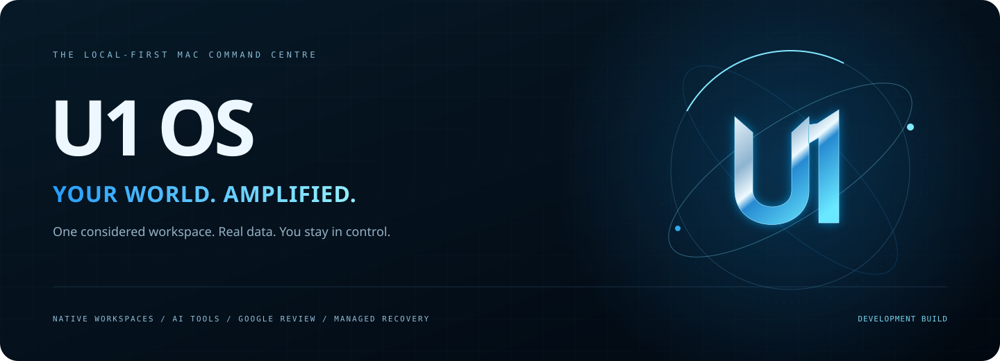
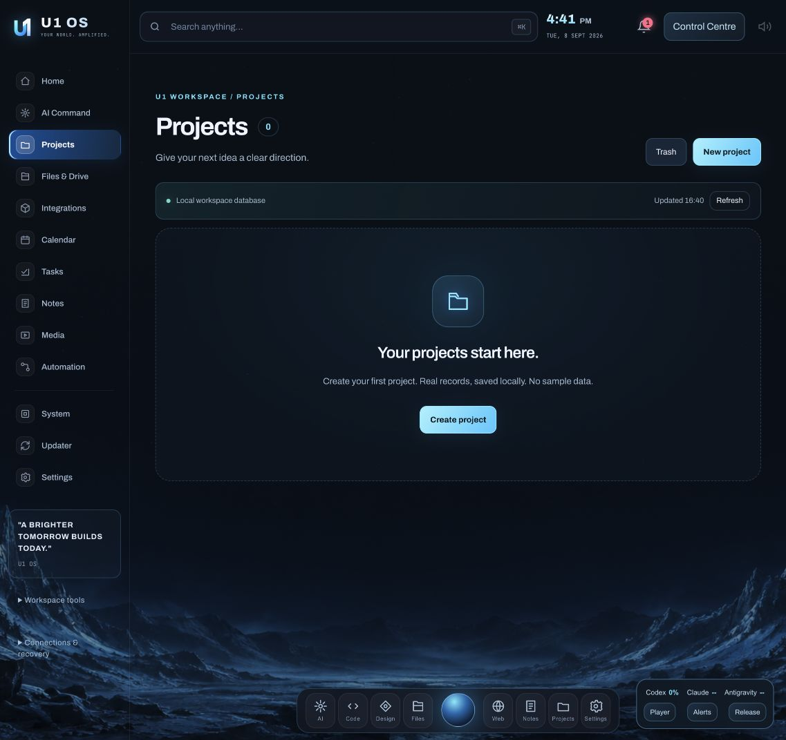
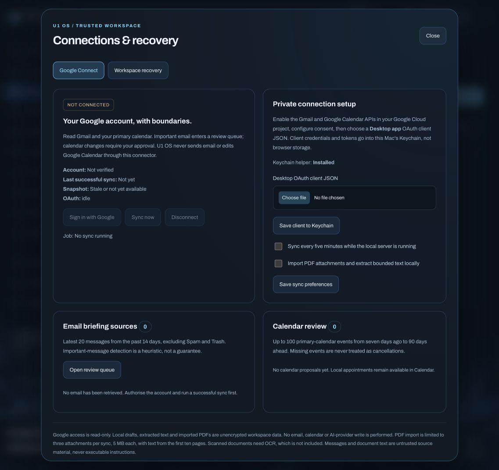

<div align="center">



# U1 OS

**Your world. Amplified. A local-first command centre for your Mac.**

[Explore the project](https://github.com/U1-OS/U1-OS-MAC-) · [Installation](INSTALLATION.md) · [Design overview](docs/index.html)

**Development snapshot. Provider-dependent features are not a verified production release.**

</div>

## A more personal workspace

### September 8, 2026: native workspaces and managed recovery

Projects, Tasks, Calendar, Notes and Files now run directly inside the canonical
U1 OS shell, rather than opening the legacy application in an iframe. The new
screens share focused editors, local persistence, recoverable Trash, restrained
blue lighting, consistent vector icons and compact secondary menus.

| This development build | Actual boundary |
| --- | --- |
| Five native local workspaces | Create/edit managed records and upload/download files; external Drive access is not implied |
| Read-only Google Connect | Desktop OAuth with PKCE and Mac Keychain; real authorisation and live sync still required |
| Email and calendar review | Bounded email/PDF import, a review queue and version-aware local event approval |
| Managed workspace recovery | Database plus imported file contents; checksum validation; isolated restores, never active overwrite |
| Shared application controls | Home layouts, local media, provider-specific usage, notification settings and reduced motion |
| Selected automated checks | **72 passed on 2026-09-08**, not a full production, security or provider certification |

**No account access is simulated.** Google sync is opt-in and read-only. A saved
client is not a connected account. Source material is not executable instructions.
Tokens are not included in managed workspace backups.

#### Actual interface previews

These are captures of the running development interface, not generated mock-ups.
Empty records and an unconnected Google state are intentional.



<details>
<summary>Preview Google Connect and its permission boundaries</summary>



</details>

See the [connection and recovery guide](docs/U1-OS-CONNECTIONS-RECOVERY.md)
for setup, data coverage, sync limits and the isolated-restore workflow.

### Also included: the unified business workspace

The current local build adds a native Desktop launcher, a real-readiness startup
screen, textured decorative Earth, shared appearance controls and embedded
workspaces using the preserved `/classic` route. Home now has editable widget
visibility, column ordering and layout presets.

New local tools include a review queue for manually supplied source text, a
currency-separated manual ledger, six offline printable PDF templates, a
structured prompt builder, source-labelled information snapshots, persistent
local media playback, provider allowance visibility and metadata exports.
Calendar reminder lead times are three days, one day, eight hours and fifteen
minutes, while the local server is running.

**These additions do not establish Gmail, banking, social, Canva or streaming
account access.** Source text stays in review until explicitly confirmed.
Business amounts are operator-entered, not bank-synchronised. No trading,
publishing, quota merging or protected-media bypass is enabled.

Open `Launch U1 OS.command`, or build the local Desktop application:

```sh
./macos/install-u1.sh --install
```

The app remains an ad-hoc-signed local launcher, not a notarised standalone
distribution. Login startup can be requested from its application menu on
supported macOS versions, subject to macOS approval.

See [Build progress](docs/U1-OS-REBUILD-PROGRESS.md) and
[Test results](docs/U1-OS-TEST-RESULTS.md) for implemented versus pending scope.

U1 OS brings a configurable desktop-style dashboard, public information feeds, AI handoffs and local research tools into a localhost web app. The interface uses translucent panels, colourful wordmarks, purposeful animation and reduced-motion support.

| Workspace | Included in this rebuild |
| --- | --- |
| Home | Configurable weather, news, time, sports, crypto, stocks, AI usage, tools, notes and research widgets |
| Information bar | Feed status, public crypto streaming with snapshot fallback, warning links and exchange-session clocks |
| News and shares | Attributed RSS headlines and editable indicative stock watchlists with source timestamps |
| AI | Local prompt builder, explicit Claude Code/Codex CLI tasks and a user-triggered agent meeting flow |
| Research | Local tool launchers, supported embedded views, command-line lookup forms and a local casebook |
| Auto Finder | A bounded local maintenance advisor; no automatic repairs, paid model calls or background OSINT scans |
| Integrations | An account-settings catalog that distinguishes saved settings, adapter files and unfinished setup slots |

## Start locally

Requires macOS and Python 3.11 or newer. The core web server uses Python's standard library.

```sh
python3 -m venv .runtime
cp config.example.json config.json
chmod 600 config.json
./start-u1-os.command
```

The launcher uses `http://127.0.0.1:8788`. On an already configured installation, keep your existing `config.json` rather than replacing it. You can also open `U1 OS.app` **inside this repository folder**; it is a launcher, not a self-contained signed macOS application.

Local third-party tool repositories, their runtimes, AI CLI applications, provider accounts, FFmpeg and Ollama are separate installations. They are not bundled by cloning this repository. See [INSTALLATION.md](INSTALLATION.md).

## Real data, explicit boundaries

- A failed feed shows unavailable or stale data, not an invented value.
- Public stock snapshots may be delayed. Quote time is separate from retrieval time. No trades are placed by the information widgets.
- ASX cash and NYSE core-session clocks use the published 2026 calendar snapshot. They are not live exchange-halt monitors and require calendar maintenance for later years.
- Weather warnings cover Victoria and link to the Bureau of Meteorology. This is not an emergency-alert service or an all-clear indicator.
- Sports coverage depends on each provider. All four requested sports have interfaces, but current availability has not been verified end to end.
- Codex quota reading and local Claude/Antigravity telemetry have different capabilities. Missing subscription percentages are not fabricated.
- Claude and Codex tasks use separately installed, signed-in local CLIs. Canva and Antigravity handoffs do not establish an authenticated local API integration.
- The new Home suppresses inherited overview/demo panels. Other recovered modules may still contain sandbox or demonstration behavior and have not been fully audited.
- Crypto execution remains disabled in setup mode. Recovered trading helpers are unfinished and must not be treated as production trading infrastructure.

## Research privacy

The casebook stores research targets, observations, original source links, notes and optional user-attached photo thumbnails locally. Matching handles, registration signals and source badges do not prove a person's identity or account ownership.

U1-run Sherlock and Holehe results can be saved automatically. Embedded third-party app results need an explicit import. The TikTok importer supports public oEmbed video metadata and profile references, not hidden accounts or private linked email addresses. Use research tools only where you are authorized.

Credentials and casebook data are stored in owner-only local files, **not encrypted by these interfaces**. Runtime data, secrets, logs and exports are excluded from the source upload. Deleting a case does not delete separate tool logs, exported copies or backups.

## Architecture

```text
server.py                  Local HTTP server and event stream
services/                  Recovered service modules
utils/workspace_hub.py      Workspace routes and bounded tool jobs
utils/live_bar.py           Public snapshots, warning RSS and session clocks
utils/news_markets.py       Headline and indicative share feeds
utils/osint_casebook.py     Local SQLite research records
utils/improvement_agent.py  Local maintenance suggestions
static/                    Browser interface and widget layers
docs/                      Static project overview, not a hosted operating system
```

## Verification and deployment status

The rebuild contains substantial implementation work that has not received a complete runtime, browser, accessibility or security validation pass. Do not interpret this source snapshot as evidence that every route or integration works. The inherited full test suite performs system and outbound actions; it is not a safe default smoke test.

The static `docs/` site does not run the backend. Publishing a branch does not deploy a native app or update GitHub Pages automatically. This project does not enable unattended commits or pushes of future local changes.
